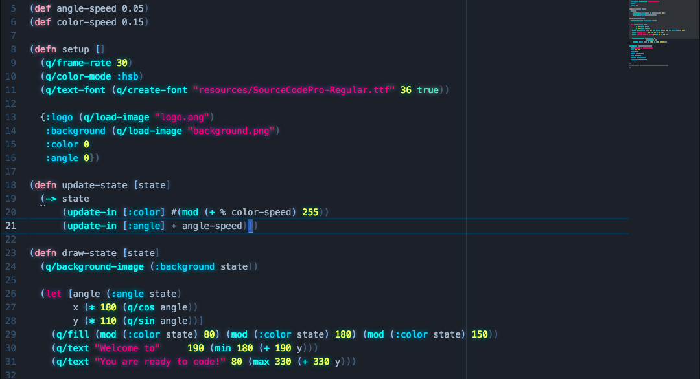
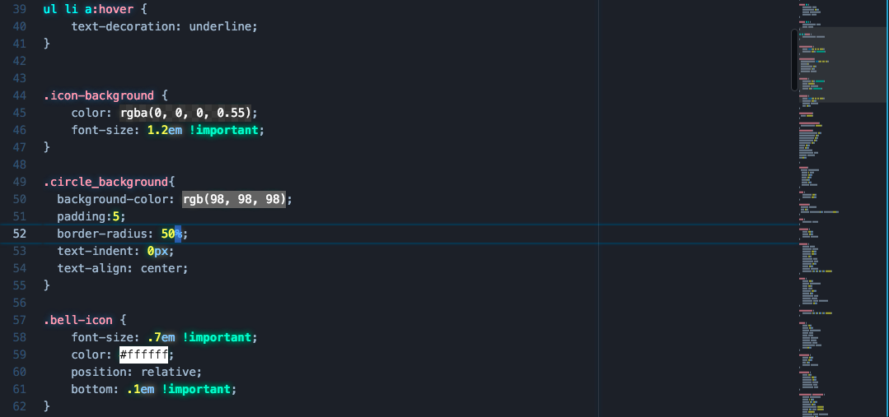
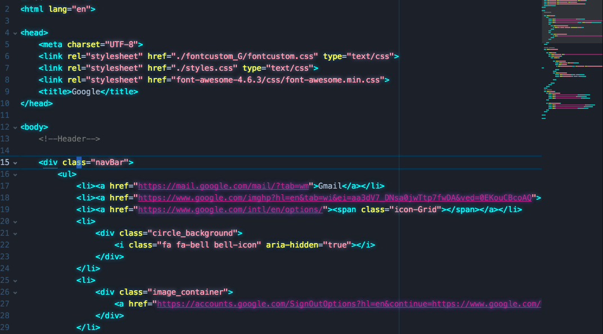

Miami vice inspired theme based on by neon-syntax : https://atom.io/themes/neon-syntax and
 steam-pirate-syntax:https://github.com/v3ss0n/steam-pirate-syntax.  
 Colors were hand picked from the 1980's TV show Miami Vice"

 ### Supported languages

 - Clojure
 - CSS / Less /
 - HTML  

### Screenshots
#### Clojure
  
#### CSS

#### HTML

